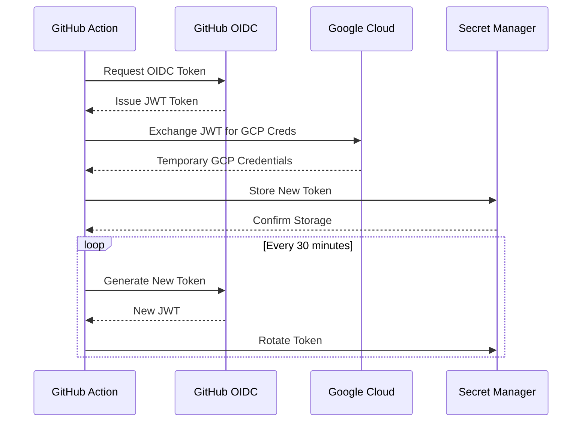

--- FILE: docs/ai-agents/labs/copilot/lab-05.2/README.md ---
# Lab 05.2 - Skills: Example Files

This folder contains the example files used in the
[Skills lab guide](../../../github-copilot/cli/07-skills.md).

## Folder Structure

```
lab-05.2/
├── README.md
├── .github/
│   └── skills/
│       ├── ci-debug/
│       │   ├── SKILL.md              ← Phase 2: CI Debug skill
│       │   └── scripts/
│       │       └── extract-errors.sh ← Optional log filter script
│       ├── pr-review/
│       │   └── SKILL.md             ← Extra: PR Review skill
│       └── release-notes/
│           └── SKILL.md             ← Extra: Release Notes skill
├── logs/
│   └── runner.log                   ← Phase 3: Sample CI failure log
└── src/
    └── payment/
        └── processor.go             ← Phase 3: Sample Go file for PR review
```

## Usage

Copy `.github/skills/` into your own repository. Start a Copilot CLI session
from that directory -- skills are discovered automatically.

```bash
copilot
```

Verify the skills are loaded:

```
/skills list
```

Invoke a skill explicitly:

```
Use the /ci-debug skill to analyze @logs/runner.log
Use the /pr-review skill on @src/payment/processor.go
/release-notes draft release notes for the last sprint
```

Or let Copilot auto-detect based on the skill description:

```
The CI run just failed. The log is at @logs/runner.log
```

## Files

| Skill directory | Skill name | Auto-triggers on | Purpose |
|----------------|-----------|------------------|---------|
| ci-debug/ | /ci-debug | CI failures, runner logs, workflow errors | Diagnose failures and draft a GitHub issue |
| pr-review/ | /pr-review | Code review requests | Security, correctness, readability, tests |
| release-notes/ | /release-notes | Release notes or changelog requests | Generate user-facing release notes |
| logs/runner.log | - | - | Sample JSON CI failure log for testing /ci-debug |
| src/payment/processor.go | - | - | Sample Go file for testing /pr-review |
--- END FILE ---

--- FILE: docs/teams/ci/macos/index.md ---
---
navigation_title: "macOS Runners"
description: "Documentation for using macOS runners in CI/CD pipelines."
applies_to:
  teams: ci
---

# MacOS Runners for the CI/CD

## Overview

macOS runners are used for building, testing, and signing Apple-platform artifacts (macOS, iOS) in our CI/CD pipelines. These runners are provisioned as ephemeral instances and are available for both GitHub Actions and Buildkite.

## When to use macOS runners

Use a macOS runner when your job requires:

- **Xcode toolchain** — building or testing Swift, Objective-C, or mixed-language projects.
- **Code signing and notarization** — producing signed `.app`, `.pkg`, or `.dmg` artifacts with Apple Developer certificates.
- **macOS-specific integration tests** — tests that depend on macOS frameworks (e.g., Security.framework, Keychain, SystemConfiguration).
- **Homebrew formula validation** — testing `brew install` and `brew test` flows.

For all other workloads, prefer Linux runners — they are cheaper and more readily available.

## GitHub Actions

Specify the runner label in your workflow:

```yaml
jobs:
  build:
    runs-on: macos-14  # Apple Silicon (M1)
    steps:
      - uses: actions/checkout@v4
      - run: xcodebuild -version
```

Available labels:

| Label | Architecture | Notes |
|-------|-------------|-------|
| `macos-14` | Apple Silicon (M1) | Recommended default |
| `macos-13` | Intel x86_64 | Use only when Intel is required |

## Buildkite

Use the `macos` agent queue:

```yaml
steps:
  - label: ":mac: Build"
    command: "make build"
    agents:
      queue: "macos"
```

## Troubleshooting

| Symptom | Likely cause | Fix |
|---------|-------------|-----|
| Job queued indefinitely | No macOS agents available | Check agent pool status in `#observability-robots`; macOS capacity is limited |
| Code signing fails with `errSecInternalComponent` | Keychain not unlocked | Ensure `security unlock-keychain` runs before signing steps |
| `xcodebuild` fails with missing SDK | Xcode version mismatch | Pin the Xcode version with `xcodes select` or `xcode-select -s` |
| Homebrew install times out | Rate-limited or network issue | Retry the step; consider caching Homebrew downloads |

## Limitations

- **Limited capacity** — macOS runners are more expensive to provision. Avoid long-running jobs and prefer parallelization over sequential steps.
- **No nested virtualization** — you cannot run macOS VMs inside macOS runners.
- **Ephemeral only** — do not rely on state persisting between jobs. Cache explicitly.

## Related documentation

- [GitHub Actions runner images](https://github.com/actions/runner-images)
- [Buildkite macOS agents](https://buildkite.com/docs/agent/v3/macos)
--- END FILE ---

--- FILE: docs/teams/ci/secrets-security-incident-runbook.md ---
# Security Incident Runbook: Secrets Compromise

This runbook provides step-by-step procedures for responding to security incidents involving compromised secrets managed by the Observability CI team.

## Table of Contents

- [Overview](#overview)
- [Secrets Inventory](#secrets-inventory)
- [Incident Severity Classification](#incident-severity-classification)
- [Immediate Response Procedures](#immediate-response-procedures)
- [Secret-Specific Response Procedures](#secret-specific-response-procedures)
- [Prevention and Monitoring](#prevention-and-monitoring)
- [Contact Information](#contact-information)

## Overview

The Observability CI team manages secrets across multiple platforms for CI/CD operations. This runbook outlines the procedures to follow when a secret is suspected to be compromised or exposed.

**Key Principles:**
- Act quickly to minimize exposure window
- Document all actions taken
- Coordinate with Security team for critical incidents
- Rotate secrets even if compromise is only suspected

## Secrets Inventory

### Current Secret Storage Systems

| System | Usage | Access Method | Rotation Capability |
|--------|-------|---------------|---------------------|
| **Vault CI** | Shared secrets for Buildkite pipelines | `vault-secrets-buildkite-plugin` | Manual/Automated |
| **Google Secret Manager** | GCP secrets for Buildkite | `oblt-google-secrets-buildkite-plugin` | Manual/Automated |
| **GitHub Secrets** | Repository and organization secrets | Infrastructure as Code (Terrazzo) | Automated via IaC |
| **GitHub Apps** | Ephemeral tokens for CI/CD | `elastic-observability` and `elastic-observability-automation` apps | Automatic (ephemeral) |
| **OIDC/Keyless** | AWS, GCP, Azure authentication | Workload Identity Federation | N/A (no long-lived secrets) |

### Types of Secrets We Manage

1. **GitHub Tokens**
   - GitHub App credentials (App ID + Private Key)
   - Personal Access Tokens (PATs) - `deprecated`
   - Machine user tokens - `deprecated`

2. **Cloud Provider Credentials**
   - AWS credentials (via OIDC preferred)
   - GCP service account keys (via OIDC preferred)
   - Azure credentials (via OIDC preferred)

3. **CI/CD Platform Secrets**
   - Buildkite API tokens
   - GitHub Actions secrets

## Incident Severity Classification

### Critical (P1)
- **Ideal Response Time:** Immediate (within 15 minutes)
- **Criteria:**
  - Production secrets exposed publicly (e.g., committed to public repository)
  - Active exploitation detected
  - Secrets with write access to production systems
  - Cloud provider credentials with broad permissions

### High (P2)
- **Ideal Response Time:** Within 1 hour
- **Criteria:**
  - Secrets exposed in private repository accessible to many users
  - Secrets with read access to sensitive data
  - CI/CD credentials that could disrupt operations

### Medium (P3)
- **Ideal Response Time:** Within 4 hours
- **Criteria:**
  - Secrets exposed to limited trusted audience
  - Deprecated secrets that might still be active
  - Test/development environment credentials

### Low (P4)
- **Ideal Response Time:** Within 24 hours
- **Criteria:**
  - Expired secrets found in logs
  - Secrets already rotated but found in historical data
  - Non-functional or dummy credentials

## Immediate Response Procedures

### Step 1: Incident Detection and Assessment (0-5 minutes)

1. **Identify the compromised secret:**
   - Document exactly what was exposed (secret type, name, scope)
   - Note when and where the exposure occurred
   - Determine the exposure method (git commit, logs, error message, etc.)

2. **Assess the scope:**
   - What systems does this secret provide access to?
   - What permissions does this secret grant?
   - How long has the secret been exposed?
   - Who had access to the exposed location?

3. **Classify the incident severity** using the table above

4. **Create an incident ticket:**
   - See https://elasticco.atlassian.net/wiki/spaces/EN/pages/48868654/How+to+Report+an+Event

### Step 2: Immediate Containment (5-15 minutes)

#### For Public Exposure
1. **Remove the exposed secret immediately:**

2. **Notify the security team:**
   - Slack: `#security-team`
   - Email: `infosec@elastic.pagerduty.com`
   - Include incident ticket number

3. **For GitHub exposures, use GitHub's secret scanning alerts:**
   - GitHub automatically detects some secret types
   - Follow GitHub's recommended actions for exposed tokens

#### For Private Exposure
1. **Limit access:**
   - Review who has access to the exposure location
   - Consider revoking access temporarily if necessary

2. **Document access logs:**
   - Check who accessed the secret location during exposure window
   - Save relevant logs for investigation

3. **Notify the security team:**
   - Slack: `#security-team`
   - Email: `security@elastic.co`
   - Include incident ticket number

### Step 3: Notify Stakeholders (15-30 minutes)

1. **Notify the Observability CI team:**
   - Slack: `#observability-robots`

2. **For critical incidents, notify:**
   - Engineering Manager
   - Director of Engineering (for P1 incidents)
   - Security team lead

3. **Prepare initial communication:**
   ```
   🚨 Security Incident: Secret Compromise

   Severity: [P1/P2/P3/P4]
   Secret Type: [type]
   Affected Systems: [list]
   Status: Containment in progress
   ETA for Resolution: [estimate]

   Actions taken:
   - [list immediate actions]

   Next steps:
   - [list planned actions]
   ```

## Secret-Specific Response Procedures

### GitHub Tokens

#### GitHub App Credentials (Preferred Method)
**Location:** Managed via `observability-github-secrets` repository

**Rotation Procedure:** See [GitHub App credential rotation reminder workflow](https://github.com/elastic/observability-robots/blob/main/.github/workflows/rotate-girthub-app-creds-reminder.yml)

### Vault CI Secrets

**Location:** Managed via Vault CI at https://vault-ci.elastic.dev

**Rotation Procedure:**

1. **Identify the affected secret path** in Vault CI (e.g., `secret/ci/elastic-<repo>/<secret-name>`).
2. **Generate a new secret value** using the appropriate method for the secret type (API key regeneration, new token creation, etc.).
3. **Write the new secret to Vault CI:**
   ```bash
   vault write secret/ci/elastic-<repo>/<secret-name> value=<new-secret-value>
   ```
4. **Verify the update** by reading back the secret metadata (do not print the value):
   ```bash
   vault read -field=value secret/ci/elastic-<repo>/<secret-name> | sha256sum
   ```
5. **Trigger a test pipeline** in the affected repository to confirm the new secret works.
6. **Revoke the old secret** at its source (e.g., revoke the old API key in the issuing service).
7. **Document the rotation** in the incident ticket with the timestamp and the Vault path updated.

### Google Secret Manager Secrets

**Location:** GCP Secret Manager for use with `oblt-google-secrets-buildkite-plugin`

**Rotation Procedure:**

1. **Identify the affected secret** in GCP Secret Manager (project: `elastic-observability-ci`).
2. **Generate a new secret value** using the appropriate method for the secret type.
3. **Add a new secret version:**
   ```bash
   echo -n "<new-secret-value>" | gcloud secrets versions add <secret-name> \
     --data-file=- \
     --project elastic-observability-ci
   ```
4. **Verify the new version is active:**
   ```bash
   gcloud secrets versions list <secret-name> --project elastic-observability-ci
   ```
5. **Disable the compromised version:**
   ```bash
   gcloud secrets versions disable <compromised-version-number> \
     --secret=<secret-name> \
     --project elastic-observability-ci
   ```
6. **Trigger a test pipeline** in the affected repository to confirm the new secret works.
7. **Destroy the compromised version** after confirming the new version is functional:
   ```bash
   gcloud secrets versions destroy <compromised-version-number> \
     --secret=<secret-name> \
     --project elastic-observability-ci
   ```
8. **Document the rotation** in the incident ticket.

### GitHub Repository Secrets (IaC-managed)

**Location:** Managed via `observability-github-secrets` with Terrazzo

**Rotation Procedure:** [github-secrets.md](./secrets/github-secrets.md)

### Cloud Provider Credentials

#### Preferred: OIDC/Keyless (No Secret Rotation Needed)
**These use short-lived tokens and don't require rotation.**

**Reference**: [Keyless documentation](./keyless/index.md)

#### Legacy: Service Account Keys (If Still in Use)

**AWS:**

1. **Identify the affected IAM user or role** and the associated access key ID.
2. **Create a new access key** for the IAM user in the AWS Console or via CLI:
   ```bash
   aws iam create-access-key --user-name <iam-user-name>
   ```
3. **Update the stored credential** in the relevant secret store (Vault CI or GitHub Secrets) with the new access key ID and secret access key.
4. **Trigger a test pipeline** to verify the new credentials work.
5. **Deactivate the compromised access key:**
   ```bash
   aws iam update-access-key --user-name <iam-user-name> \
     --access-key-id <compromised-key-id> --status Inactive
   ```
6. **Delete the compromised access key** after confirming the new key is functional:
   ```bash
   aws iam delete-access-key --user-name <iam-user-name> \
     --access-key-id <compromised-key-id>
   ```
7. **Review CloudTrail logs** for unauthorized usage of the compromised key.
8. **Document the rotation** in the incident ticket.

> [!IMPORTANT]
> Migrate to OIDC/Keyless authentication to avoid managing long-lived AWS credentials. See [Keyless documentation](./keyless/index.md).

**GCP:**

1. **Identify the affected service account** and key ID in the GCP Console or via CLI:
   ```bash
   gcloud iam service-accounts keys list --iam-account=<sa-email>
   ```
2. **Create a new service account key:**
   ```bash
   gcloud iam service-accounts keys create new-key.json \
     --iam-account=<sa-email>
   ```
3. **Update the stored credential** in the relevant secret store (Vault CI, GCP Secret Manager, or GitHub Secrets) with the new key.
4. **Trigger a test pipeline** to verify the new credentials work.
5. **Delete the compromised key:**
   ```bash
   gcloud iam service-accounts keys delete <compromised-key-id> \
     --iam-account=<sa-email>
   ```
6. **Securely delete the local key file:**
   ```bash
   rm -f new-key.json
   ```
7. **Review GCP Audit Logs** for unauthorized usage of the compromised key.
8. **Document the rotation** in the incident ticket.

> [!IMPORTANT]
> Migrate to Workload Identity Federation (OIDC) to avoid managing long-lived GCP service account keys. See [Keyless documentation](./keyless/index.md).

## Prevention and Monitoring

### Proactive Measures

1. **Use Preferred Secret Methods:**
   - **OIDC/Keyless:** No long-lived secrets
   - **Platform Productivity Ephemeral tokens:** Ephemeral GitHub tokens, scoped permissions.
   - **GitHub Apps:** Ephemeral tokens, scoped permissions
   - **Vault CI Shared Secrets:** Centralized management
   - **Infrastructure as Code:** Version controlled, auditable

2. **Avoid Deprecated Methods:**
   - ❌ Personal Access Tokens (PATs)
   - ❌ Machine user accounts
   - ❌ Hardcoded credentials
   - ❌ Credentials in code repositories

3. **Regular Secret Audits:**
   - Yearly rotation of long-lived secrets
   - Annual access review for stalled secrets

4. **Automated Detection:**
   - GitHub secret scanning (automatic)
   - Pre-commit hooks with secret scanners
   - CI/CD pipeline scanning
   - Log monitoring for exposed credentials

### Monitoring and Alerting

> [!NOTE]
> Likely something we don't need to be part of as it's already audited by
> infosec.

### Secret Lifecycle Best Practices

| Stage | Best Practice | Responsibility |
|-------|--------------|----------------|
| **Creation** | Use most secure method available (OIDC > Ephemeral > Long-lived) | Developer |
| **Storage** | Store in approved secret stores only (Vault CI, GSM, GitHub Secrets) | CI Team |
| **Access** | Principle of least privilege, scope to minimum required | Developer |
| **Usage** | Never log or print secrets, use in memory only | Developer |
| **Rotation** | Yearly for long-lived, automatic for ephemeral | CI Team |
| **Revocation** | Immediate upon compromise or deprecation | CI Team |
| **Audit** | Yearly review of all secrets | CI Team |

## Contact Information

### Primary Contacts

- **Observability CI Team:** `#observability-robots` (Slack)
- **On-Call Engineer:** `@observability-robots-oncall` (Slack)
- **Security Team:** `#security-team` (Slack) or `security@elastic.co`

### Escalation Path

1. **First Response:** Observability CI on-call engineer
2. **P1/P2 Escalation:** Engineering Manager
3. **Security Escalation:** Security team lead
4. **Executive Escalation:** Director of Engineering

### Related Documentation

- [Secret Management](./secrets/secret-management.md)
- [GitHub Secrets](./secrets/github-secrets.md)
- [GitHub Ephemeral Tokens](./secrets/github-ephemeral-tokens.md)
- [Keyless/OIDC Documentation](./keyless/index.md)
- [Buildkite Guidelines](./buildkite/buildkite-guidelines.md)
- [Secrets Management Best Practices](https://elasticco.atlassian.net/wiki/spaces/EN/pages/387711041/Secrets+Management+Best+Practices)
- [How to report an event](https://elasticco.atlassian.net/wiki/spaces/EN/pages/48868654/How+to+Report+an+Event)
--- END FILE ---

--- FILE: docs/teams/ci/dependencies/updatecli.md ---
# Updatecli

[Updatecli](https://www.updatecli.io/docs/prologue/quick-start/) is our preferred tool for bumping dependencies or running some adhoc automation
when `Dependabot` cannot be the tool.

## Structure

An updatecli configuration typically lives in the `updatecli/` or `.ci/updatecli/` directory at the root of a repository. The standard layout is:

```
updatecli/
├── manifests/           # Updatecli manifest YAML files (one per dependency or group)
│   ├── bump-golang.yml
│   ├── bump-docker.yml
│   └── ...
├── values.d/            # Shared value files referenced by manifests
│   └── scm.yml          # SCM (source control) configuration (repo, branch, committer)
└── policies/            # (Optional) Local policy overrides, if not using shared policies
```

- **Manifests** define what to update (source), how to find the current version (condition), and where to apply the change (target). Each manifest is a standalone YAML file.
- **Values files** (in `values.d/`) contain shared configuration such as SCM credentials, branch names, and committer identity. Manifests reference these with `--values`.
- **Policies** are reusable manifests published to a registry. Our shared policies live in [elastic/oblt-updatecli-policies](https://github.com/elastic/oblt-updatecli-policies/tree/main/updatecli/policies).

Some repositories use `.ci/updatecli/` instead of `updatecli/` — both are supported. Check the GitHub Actions workflow in the repo to see which path is configured.

## Share and reuse

We have created a shared library of Updatecli manifests, called policies in this case, that can
be used in any repository at Elastic.

You can read more about how the [share and reuse](https://www.updatecli.io/docs/core/shareandreuse/) works in `updatecli`.

In our case, https://github.com/elastic/oblt-updatecli-policies is the repository we use for sharing
common updates. And the shared policies can be found at https://github.com/elastic/oblt-updatecli-policies/tree/main/updatecli/policies.

## GitHub actions

### Quick start

`updatecli` runs locally and in the CI, for such, it's well integrated with GitHub actions.
If you use GitHub actions as your primary CI in your GitHub repository, then you need to
use [github ephemeral tokens](../secrets/github-ephemeral-tokens.md).

There is a good recipe explaining how to use `updatecli` in the GitHub actions docs, see the [updatecli](../github-actions/github-actions-recipes.md#updatecli) section.

Here is an example of an `updatecli` manifest named `updatecli/bump.yml` that runs on GitHub Actions and utilises the GitHub ephemeral tokens app.

<details>
<summary>Code</summary>

```yaml
---
name: bump

on:
  workflow_dispatch:
  schedule:
    - cron:  '0 20 * * 6'

permissions:
  contents: read

jobs:
  bump:
    runs-on: ubuntu-latest
    # If you don't use GitHub actions in your github repository as the primary CI
    # If you do then remove the below permissions.
    permissions:
      contents: write
      pull-requests: write
    steps:
      - uses: actions/checkout@v4

      # NOTE: Keep the below step if you use GitHub actions in your github repository
      # as the primary CI. Otherwise, remove the below permissions.
      - name: Get token
        id: get_token
        uses: tibdex/github-app-token@3beb63f4bd073e61482598c45c71c1019b59b73a # v2.1.0
        with:
          app_id: ${{ secrets.OBS_AUTOMATION_APP_ID }}
          private_key: ${{ secrets.OBS_AUTOMATION_APP_PEM }}
          permissions: >-
            {
              "contents": "write",
              "pull_requests": "write"
            }
          repositories: >-
            [ "elastic-agent" ]

      - uses: elastic/oblt-actions/updatecli/run@v1
        with:
          command: apply --config updatecli/bump.yml
        # NOTE: Keep the below step if you use GitHub actions in your github repository
        # as the primary CI. Otherwise, remove the below permissions.
        env:
          GITHUB_TOKEN: ${{ steps.get_token.outputs.token }}
```

</details>

### Support Unified Release branches

If you need to update multiple branches, then you can use the below github workflow:

<details>
<summary>Code</summary>

```yaml
---
name: bump-elastic-stack-snapshot

on:
  workflow_dispatch:
  schedule:
    - cron: '0 15 * * 1-5'

permissions:
  contents: read

jobs:
  filter:
    runs-on: ubuntu-latest
    timeout-minutes: 1
    outputs:
      matrix: ${{ steps.generator.outputs.matrix }}
    steps:
      - id: generator
        uses: elastic/oblt-actions/elastic/active-branches@v1

  bump-elastic-stack:
    runs-on: ubuntu-latest
    needs: [filter]
    strategy:
      fail-fast: false
      matrix: ${{ fromJson(needs.filter.outputs.matrix) }}
    steps:
      - uses: actions/checkout@v4
        with:
          ref: ${{ matrix.branch }}

      - name: Get token
        id: get_token
        uses: tibdex/github-app-token@3beb63f4bd073e61482598c45c71c1019b59b73a # v2.1.0
        with:
          app_id: ${{ secrets.OBS_AUTOMATION_APP_ID }}
          private_key: ${{ secrets.OBS_AUTOMATION_APP_PEM }}
          permissions: >-
            {
              "contents": "write",
              "pull_requests": "write"
            }
          repositories: >-
            [ "elastic-agent" ]

      - uses: elastic/oblt-actions/updatecli/run@v1
        with:
          command: --config .ci/updatecli/bump-elastic-stack-snapshot.yml --values .ci/updatecli/values.d/scm.yml
        env:
          BRANCH: ${{ matrix.branch }}
          GITHUB_TOKEN: ${{ steps.get_token.outputs.token }}

```

</details>

## Local development

You can run updatecli locally to test manifests before pushing to CI.

### Prerequisites

Install updatecli:

```bash
brew install updatecli
```

Or download a binary from the [updatecli releases page](https://github.com/updatecli/updatecli/releases).

### Running locally

1. **Diff mode** (dry run — shows what would change without applying):

   ```bash
   updatecli diff --config updatecli/manifests/bump-golang.yml
   ```

2. **Apply mode** (applies changes locally):

   ```bash
   updatecli apply --config updatecli/manifests/bump-golang.yml
   ```

3. **With shared values** (pass SCM config or other shared values):

   ```bash
   updatecli diff --config updatecli/manifests/bump-golang.yml --values updatecli/values.d/scm.yml
   ```

4. **Using shared policies** (test a policy from the shared repo):

   ```bash
   updatecli diff --config https://github.com/elastic/oblt-updatecli-policies/raw/main/updatecli/policies/<policy>.yml
   ```

### Authentication

Most manifests require a `GITHUB_TOKEN` environment variable. Generate a personal access token with `repo` scope and export it:

```bash
export GITHUB_TOKEN=ghp_your_token_here
updatecli diff --config updatecli/manifests/bump-golang.yml
```

### Debugging

Use the `--debug` flag for verbose output:

```bash
updatecli diff --debug --config updatecli/manifests/bump-golang.yml
```

Review the output to verify that sources resolve correctly, conditions match, and targets point to the right files.
--- END FILE ---

--- FILE: docs/teams/ci/keyless/gh-ephemeral-tokens-gcp.md ---
# Ephemeral GitHub Tokens with OpenID Connect

## 1. Overview

This document outlines our solution for generating ephemeral GitHub tokens using OpenID Connect (OIDC) and a GitHub App to enhance security by eliminating long-lived credentials.

## 2. Motivation

### 2.1 Problem Statement

- Manual token rotation is operationally expensive
- Long-lived credentials pose security risks if compromised

### 2.2 Solution Benefits

- **Eliminates long-lived credentials**: No more static tokens stored in GitHub Secrets.
- **Automated rotation**: Tokens automatically refresh every 30 minutes.
- **Reduced attack surface**: Shorter token lifetimes minimize exposure.
- **GitHub Actions native**: No external services or complex infrastructure required.

## 3. Architecture



## 4. Implementation Details

### 4.1 GitHub secrets

Create GitHub secret request using the [GitHub issue automation](https://github.com/elastic/observability-github-secrets/issues/new?template=new-secret-issue.yaml).

Then review and merge.

### 4.2 GitHub actions

We use https://github.com/tibdex/github-app-token to generate ephemeral tokens using our existing [github-apps](../../../machine-user.md).
```yaml
---
## Workflow to generate and store an ephemeral GitHub token in Google Cloud Secret Manager.
name: ephemeral-github-token
on:
  workflow_dispatch:
  schedule:
    - cron: '*/30 * * * *'

permissions:
  contents: read

jobs:
  tools:
    runs-on: ubuntu-latest
    permissions:
      id-token: write
      contents: read
    env:
      GCP_PROJECT: elastic-observability-ci
      GCSM_SECRET_NAME: your-repo-secret_github-token
    steps:
      - uses: actions/checkout@v4

      - name: Authenticate to Google Cloud
        uses: elastic/oblt-actions/google/auth@v1

      - name: Set up Cloud SDK
        uses: google-github-actions/setup-gcloud@77e7a554d41e2ee56fc945c52dfd3f33d12def9a

      - name: Get token from GitHub App
        id: get_token_from_app
        uses: tibdex/github-app-token@3beb63f4bd073e61482598c45c71c1019b59b73a # v2.1.0
        with:
          app_id: ${{ secrets.OBS_AUTOMATION_APP_ID }}
          private_key: ${{ secrets.OBS_AUTOMATION_APP_PEM }}
          # We don't revoke the token automatically, its TTL is 60 minutes
          revoke: false
          permissions: >-
            {
              "contents": "write",
              "issues": "write",
              "pull_requests": "write",
              "members": "read",
              "checks": "read"
            }
          repositories: >-
            ["your-repo"]

      - name: Write GCSM secret Token
        env:
          GITHUB_TOKEN: ${{ steps.get_token_from_app.outputs.token }}
        run: |
           echo -n "${GITHUB_TOKEN}" | gcloud secrets versions add "${GCSM_SECRET_NAME}" \
                  --data-file=- \
                  --quiet \
                  --project "${GCP_PROJECT}"
```

### 4.3 Terraform

See [docs](./index.md)

```terraform
data "google_project" "elastic_observability_ci" {
    project = google_project.observability-ci
}

locals {
  workflow_filenames = toset([
    "ephemeral-github-token.yml",
  ])
}

module "google-github-actions-workflow-identity-provider" {
  source             = "../../../../modules/google-github-actions-workflow-identity-provider"
  repository         = "your-repo"
  workflow_filenames = local.workflow_filenames
  project_id         = data.google_project.elastic_observability_ci.project_id
}

module "google-oblt-cluster-secrets-access" {
  source  = "../../../../modules/google-oblt-cluster-secrets-access"
  members = values(module.google-github-actions-workflow-identity-provider.principals)
}

/*
@description Grant access to the your-repo-secret_github-token GCSM secret
*/
resource "google_project_iam_member" "secretsmanager_secret_version_adder" {
  project = data.google_project.elastic_observability_ci.project_id
  role    = "roles/secretmanager.admin"
  member  = module.google-github-actions-workflow-identity-provider.principals["ephemeral-github-token.yml"]
  condition {
    title      = "Allow access to secrets for observability-bi_github-token workflow"
    expression = "resource.name.startsWith(\"projects/${data.google_project.elastic_observability_ci.number}/secrets/your-repo-secret_github-token\")"
  }
}
```

## 5. Security Considerations

### 5.1 Trust Model
- Relies on GitHub's OIDC provider for identity assertion
- Google Cloud's Workload Identity Federation for secure credential exchange
- Fine-grained IAM policies control access to secrets

### 5.2 Risk Mitigation
- **Short-lived tokens**: 30-minute rotation limits exposure
- **Least privilege**: GitHub App has minimal required permissions
- **Audit logging**: All secret access is logged
- **No long-term credentials**: Eliminates risk of credential leakage

### 5.3 Monitoring

The following signals and checkpoints help operators verify this workflow is functioning correctly and detect issues early.

#### Key signals to watch

| Signal | Where to find it | Healthy state |
|--------|-----------------|---------------|
| Workflow run status | GitHub Actions tab → `ephemeral-github-token` workflow | Green checks every 30 minutes |
| Secret version count | GCP Console → Secret Manager → `<GCSM_SECRET_NAME>` → Versions | New version added every 30 minutes |
| OIDC token exchange | GCP Audit Logs → `sts.googleapis.com` → `ExchangeToken` | Successful exchanges matching the cron schedule |
| Secret Manager writes | GCP Audit Logs → `secretmanager.googleapis.com` → `AddSecretVersion` | One write per workflow run |

#### Logs to review

- **GitHub Actions logs**: Check the workflow run output for authentication failures, permission errors, or `gcloud` command failures.
- **GCP Audit Logs**: Filter by `protoPayload.serviceName="secretmanager.googleapis.com"` in Cloud Logging for the `elastic-observability-ci` project.
- **Workload Identity Federation logs**: Filter by `protoPayload.serviceName="sts.googleapis.com"` to trace OIDC token exchanges.

#### Alert conditions

Set up alerts for the following failure modes:

1. **Workflow not running on schedule**: If no successful workflow run appears within 60 minutes, the cron trigger or runner pool may be unhealthy. Create a GitHub Actions alert or external monitor (e.g., Datadog, PagerDuty) that checks for recent successful runs.
2. **Secret version stale**: If the latest secret version in GCP Secret Manager is older than 90 minutes, downstream consumers may be using an expired token. Monitor via a Cloud Monitoring metric on `secretmanager.googleapis.com/secret_version_count` or a periodic probe.
3. **OIDC exchange failures**: A spike in failed `ExchangeToken` calls in GCP Audit Logs may indicate a misconfigured Workload Identity pool or a GitHub OIDC outage. Alert on `severity>=ERROR` for `sts.googleapis.com` in Cloud Logging.

#### Response steps

1. **Check the latest workflow run** in the GitHub Actions tab for error details.
2. **Verify the GitHub App credentials** (`OBS_AUTOMATION_APP_ID` and `OBS_AUTOMATION_APP_PEM`) are still valid and not expired.
3. **Confirm Workload Identity Federation** is correctly configured by running a manual OIDC exchange test.
4. **Check GCP Secret Manager quotas** — ensure the project has not hit rate limits on `AddSecretVersion`.
5. **Escalate** to `#observability-robots` if the issue persists after the checks above.

## 6. Operational Considerations

### 6.1 Setup Requirements

1. GitHub App with required permissions. See [github-apps](../../../machine-user.md)
2. Google Cloud Project with Secret Manager enabled
3. GitHub secrets for the GitHub app stored in the target GitHub repository.
3. Workload Identity Federation configuration.
4. IAM policies for least privilege access.

### 6.2 Maintenance

- Regular review of GitHub App permissions
- Monitoring of token rotation
- Audit log reviews

## 7. Conclusion

This solution provides a secure, maintainable approach to GitHub App token management by leveraging OIDC and Workload Identity Federation. It eliminates long-lived credentials while maintaining automation capabilities through GitHub Actions.

## 8. References

- [Obs11 OIDC implementation](./index.md)
- [GitHub OIDC Documentation](https://docs.github.com/en/actions/deployment/security-hardening-your-deployments/about-security-hardening-with-openid-connect)
- [Google Cloud Workload Identity Federation](https://cloud.google.com/iam/docs/workload-identity-federation)
- [GitHub App Token Action](https://github.com/marketplace/actions/github-app-token)
--- END FILE ---